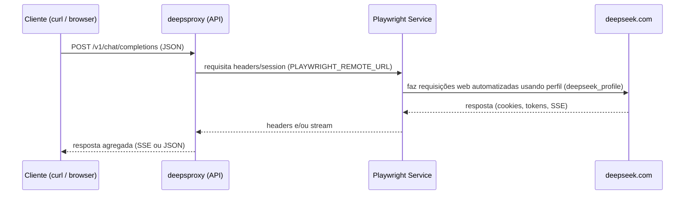

# Desenvolvimento — deepsproxy

Este documento descreve como subir o ambiente de desenvolvimento, rodar testes que reaproveitam a sessão do navegador, inspecionar logs e exemplos de requisições.

1) Subir o ambiente de desenvolvimento

- Usando o helper `dev.sh` (recomendado):

```bash
./dev.sh up
```

Para trazer os containers e seguir logs do Playwright:

```bash
./dev.sh logs
```

Observações:
- `dev.sh` usa `docker-compose.yml` e `docker-compose.dev.yml` como override.
- O ambiente dev pode usar `network_mode: host` (visibilidade do X11) — se estiver ativo, os mapeamentos de porta não aparecem no `docker ps`, mas a API está acessível em `http://localhost:$PORT` (veja `.env`).

2) Rodar testes de desenvolvimento aproveitando a sessão existente

- O teste que reaproveita a sessão atual foi criado em `src/current_session.test.ts`.
- Para executá-lo dentro do container que tem a sessão do Playwright montada (não inicie um novo navegador):

```bash
docker exec -i deepsproxy sh -c 'cd /app && timeout 20s env RUN_REAL_BROWSER_TESTS=1 PLAYWRIGHT_HEADLESS=false npx tsx --test src/current_session.test.ts'
```

- Explicação:
  - `RUN_REAL_BROWSER_TESTS=1` habilita o teste que exige uma sessão real.
  - `PLAYWRIGHT_HEADLESS=false` garante que o navegador rode em modo headed se necessário.
  - O comando assume que `deepsproxy-playwright` já está em execução e que `./deepseek_profile` está montado no container (para reaproveitar login).

3) Verificar logs de ambos os containers

- Logs do serviço Playwright (útil para ver inicialização do navegador e erros de Playwright):

```bash
docker logs -f deepsproxy-playwright
```

- Logs da API (deepsproxy):

```bash
docker logs -f deepsproxy
```

4) Diagrama de comunicação (Mermaid)



5) Exemplo de `curl` pedindo os presidentes do Brasil (2000–2025) em JSON curto

Observação: o `PORT` padrão do projeto é definido no arquivo `.env` (ex.: `PORT=9300`). Substitua se necessário.

```bash
curl -s -X POST http://localhost:9300/v1/chat/completions \
  -H 'Content-Type: application/json' \
  -d '{
    "model":"deepseek-thinking",
    "messages":[{"role":"user","content":"Retorne SOMENTE em JSON compacto a lista dos presidentes do Brasil entre 2000 e 2025, no formato [{\"inicio_mandato\":2000,\"nome\":\"Nome\"}, ...] — inclua só ano e nome, respostas curtas."}],
    "stream":false
  }'

# Exemplo de saída esperada (apenas referência):
#{"presidentes":[{"ano":2003,"nome":"Luiz Inácio Lula da Silva"},{"ano":2011,"nome":"Dilma Rousseff"},{"ano":2016,"nome":"Michel Temer"}]}
```

Dicas rápidas
- Se o `curl` apontando para `localhost:$PORT` falhar, verifique:
  - Se os containers estão up: `docker ps`.
  - Se o compose dev usa `network_mode: host`: nesse caso a porta é do host (acessível em `localhost`).
  - Logs: `docker logs deepsproxy` e `docker logs deepsproxy-playwright`.

Se quiser, posso adicionar checks automáticos ao `dev.sh` (ex.: aguardar healthcheck do Playwright, rodar `curl /health` da API) — quer que eu adicione isso?
